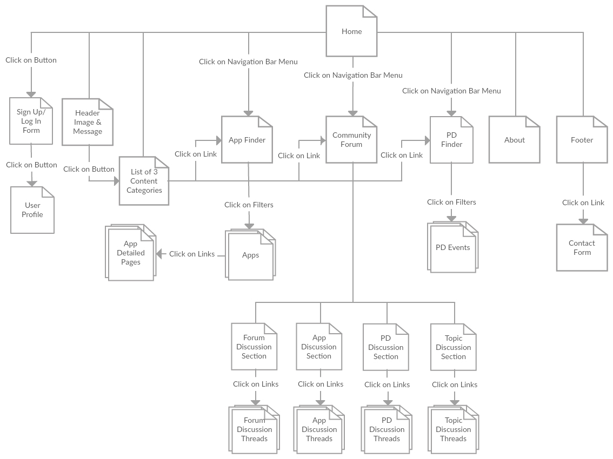
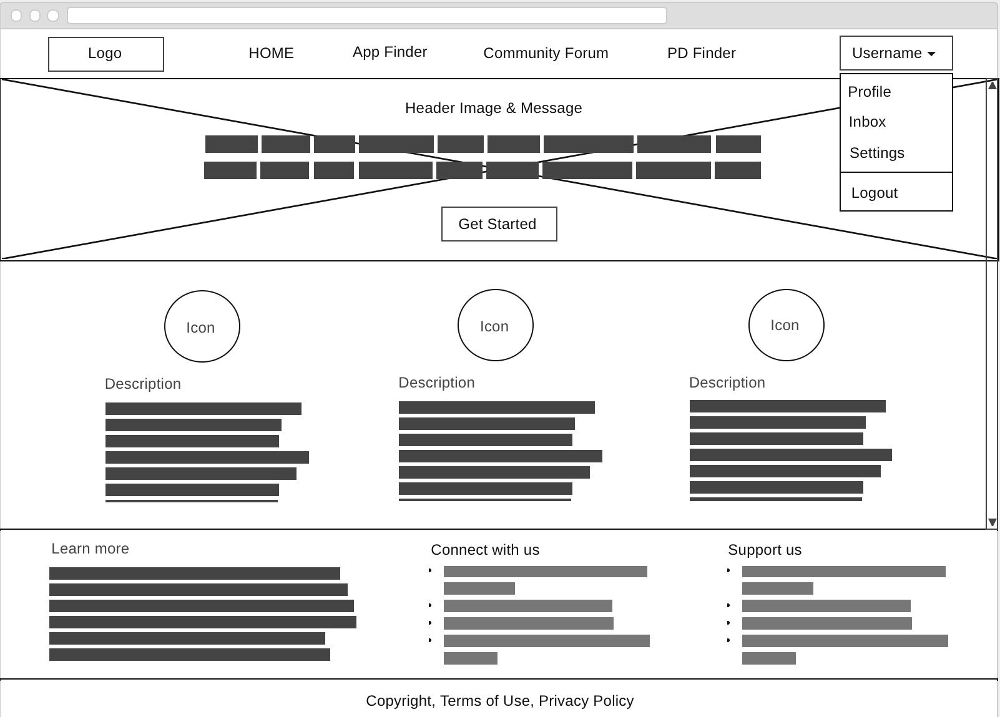
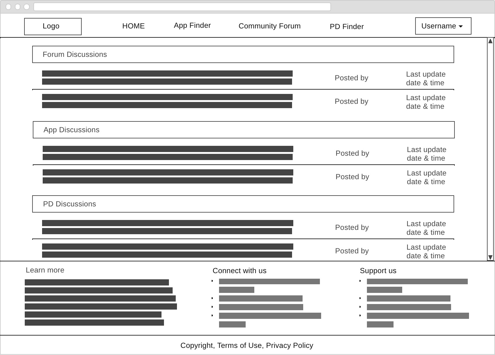
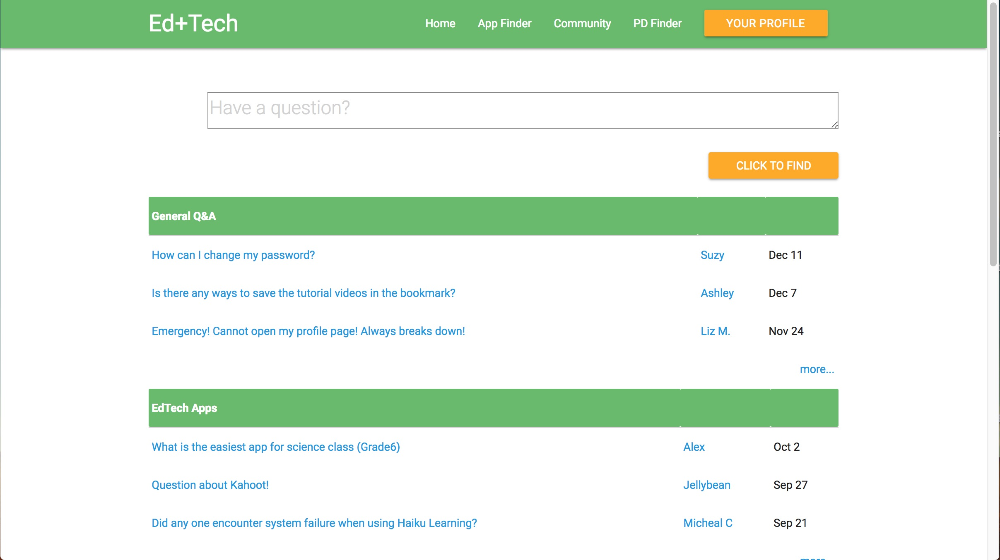

# **Design Documentation**

Our project, **Ed+Tech** (pronounced as **“edplustech”**), is an interactive website providing 21st-century educators with technology-based resources they need to support their pedagogy in their student-centered classrooms. It serves as a platform for educators with an interest or need in educational technology to find, learn, share and discuss all kinds of edtech topics. It can be accessed at this [Github Page](https://tianjiaosuzy.github.io/5013-2-final/). We have utilized Jesse Garrett's *Model of 5 Elements of User Experience* in our design thinking process, and they are outlined in the following sections:

## Topic
Our project is related to the subject of educational technology integration. Noticing the time-consuming research and comparison processes involved in looking for appropriate educational technology resources, this website combines resources finding and forum participation to build an edtech virtual community that can learn together and help each other out. Our website is a small part of the bigger domain of teacher professional development and it can be used in adjunction with other websites, programs, or networks specializing on teaching and training teachers.

## Problem
These are the main problems educators face in educational technology integration which can influence the effectiveness of their pedagogy:
1. Educators interested in educational technology want to apply technology in their classrooms but do not know what tools are available, which one fits the most, or how to use them appropriately in terms of efficiency and pedagogy.

2. Educators interested in educational technology encounter difficulties in searching for professional development events that are focused on educational technology topics.

3. Educators interested in educational technology feel difficult in finding a community where those with similar interests can share ideas, ask questions, and look for help.

## Solution and Rationale
We determined a central portal of resource information is necessary to reduce **cognitive overload** and time-wasting because most edtech resource websites only have a single purpose and they are scattered all over the Web. We utilized the learning theories of **community of practice** and **connectivism** in the edtech virtual community. Our website is a safe digital space where educators in the same network can learn from each other’s ideas and experiences to enrich their own knowledge and skills. Having interactions with other people means that educators can be motivated to use our site more frequently and this is based on the **social learning** theory.

## Target Audience
Our target audience are K-12 teachers who want to learn and apply technology integration in their own classrooms but are still novice or intermediate practitioners. They can be interested in the topic because they are new teachers working in schools with strong technology initiatives, or they are teachers who already have many years of teaching experience but want to transform their lessons in order to adapt to their 21st-century students. We have described some user stories to put these types of users in more context:

### User Stories

**User Story 1:**

{:height="100px" width="100px"}

This is Paula and she is a 22-year old who has just graduated college with an elementary education degree. She works as a first-year teacher at a charter school in New York City that is starting a one-to-one iPad initiative in the new academic year. Paula is very excited because her classroom is selected to be a part of the pilot project but at the same time, she is terrified because her iPad skills are limited to productivity apps, games and Web browsing. She feels that she knows next to nothing about educational iPad apps. Fortunately, the school has set up a mentoring system where teachers who are more technology-savvy guide those who are not. She discusses her struggles with her mentor teacher who points out our website as an easy-to-use resource. Paula likes that the app filtering system has many different options so she can narrow down the filter results to those apps that are the most suitable. While browsing the site, she also enjoys the forum where she is able to communicate with other educators who are using the same apps as her and learn from their valuable tips and tricks. Paula then bookmarks the site as one of her top ten edtech resources.

**User Story 2:**

{:height="100px" width="100px"}

This is Henry and he is a 46-year old public school teacher who has been teaching for more than 20 years. His domain of expertise is in high school mathematics and he feels very good at this point in his teaching journey. However, he noticed with each incoming batch of students that they are increasingly digital-savvy and consume a lot of their free time online. Some of his students struggle with understanding the more abstract concepts of statistics and calculus. Henry then decides to leverage the power and functionalities of technology to flip his classroom, a technique he had read in one of the educational blogs he follows but does not have the chance to implement yet. As he researches deeper, he comes across our website and checks it out to find some apps he can use. Unexpectedly, Henry finds the forum to be very useful because flipped learning is one of the hottest topic of discussion and he can find other educators who have successfully used the technique in their classrooms. He engages in long conversations with them and asks feedback for his unit plans. In addition, he discovers relevant webinars about blended learning strategies through the PD Finder. The site quickly becomes one of Henry’s favorites and he actively shares it to his colleagues.

## Strategy

### Site Objective
Educators who have beginner or intermediate level in educational technology integration can use our website as a guide to edtech resources in order to reduce time and effort used in searching so they can focus more on lesson planning and implementation.

### Site Goals
1. Educators can browse and find edtech apps that suit their needs.

2. Educators can browse and find edtech professional development events that suit their needs and interests.

3. Educators can participate in a community of practice that discuss and share ideas and additional resources on educational technology integration.

### Success Metrics
For the current midterm, we can analyze user satisfaction from the Website feedback form they fill in after they have explored our site. But ideally, we want to be able to monitor site traffic, user clicks, bookmarked apps and events, user ratings and reviews of apps and PD events, and forum discussion content.

## Scope

**Content Specifications:**
  * A message in the header image where users can understand the purpose of the site
  * Icons and short description for each sub-page to explain their purposes
  * About Us info, Contact Us and Website feedback in footer
  * App database to find specific apps based on filters
  * Information for each app on App Cards
  * PD event database to find specific events based on filters *(not functional yet)*
  * Community forum based on categories and topics *(not functional yet)*

**Functional Specifications:**
  * Navigation menu bar
  * User Sign-Up/Login button and modal forms
  * Icon and name links to each sub-page
  * Contact Us and Website feedback modal forms
  * Social network links to connect to our project
  * App filtering system with shown/hidden App Cards
  * Bookmarking system

## Structure
Here are the **information designs** of the filtering systems on our website:

Here is the **site structure** and **navigation design** of our website:

## Skeleton
Here are the **wireframes** of our website:

## Prototype
Here are the **prototypes** of our website:

## User Tests
put user test data to validate your application, explain your findings and rationale
